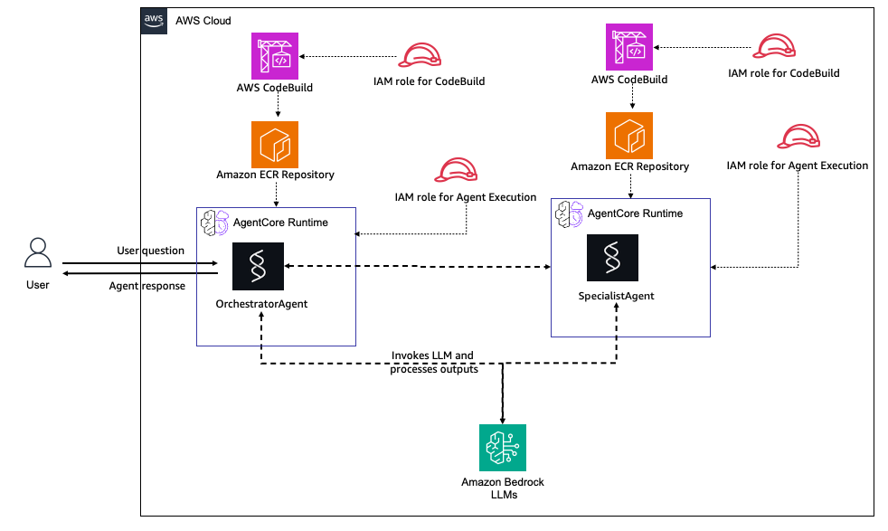

# Multi-Agent Runtime on Amazon Bedrock AgentCore (Terraform)

This Terraform module deploys a multi-agent system using Amazon Bedrock AgentCore Runtime with Agent-to-Agent (A2A) communication capabilities.

## Table of Contents

- [Overview](#overview)
- [Architecture](#architecture)
- [What's Included](#whats-included)
- [Prerequisites](#prerequisites)
- [Quick Start](#quick-start)
- [Deployment Process](#deployment-process)
- [Authentication Model](#authentication-model)
- [Testing](#testing)
- [Agent Capabilities](#agent-capabilities)
- [Customization](#customization)
- [File Structure](#file-structure)
- [Monitoring and Observability](#monitoring-and-observability)
- [Security](#security)
- [Pricing](#pricing)
- [Troubleshooting](#troubleshooting)
- [Cleanup](#cleanup)
- [Advanced Topics](#advanced-topics)
- [Next Steps](#next-steps)
- [Resources](#resources)
- [Contributing](#contributing)
- [License](#license)

## Overview

This pattern demonstrates deploying a multi-agent system with three coordinating agents that communicate via the Agent-to-Agent (A2A) protocol. The Orchestrator routes requests to either the Specialist (for detailed analysis) or the Fact Checker (for claim verification), enabling modular and scalable agent architectures with full distributed tracing.

**Key Features:**
- Three-agent architecture with multi-hop A2A communication
- ADOT (AWS Distro for OpenTelemetry) instrumentation for full distributed tracing
- Automated Docker image building via CodeBuild
- S3-based source code management with change detection
- IAM-based security with least-privilege access
- Windows (PowerShell) and Linux/macOS compatible deployment

This makes it ideal for:
- Building complex multi-agent workflows
- Implementing agent specialization patterns
- Creating scalable agent orchestration systems
- Learning A2A communication protocols

## Architecture



### System Components

**Orchestrator Agent**
- Receives initial user requests
- Routes to appropriate specialist agent(s) based on query type
- Contains tools: `call_specialist_agent` and `call_factchecker_agent`
- Has IAM permissions to invoke both downstream agents
- Can invoke multiple agents in a single request for complex queries

**Specialist Agent**
- Independent agent for detailed analysis and research
- Provides comprehensive explanations and data processing
- Invoked by Orchestrator for complex analytical tasks

**Fact Checker Agent**
- Independent agent for claim verification
- Returns structured verdicts (TRUE/FALSE/PARTIALLY TRUE) with confidence levels
- Invoked by Orchestrator when factual accuracy needs verification

### Agent-to-Agent (A2A) Communication

The A2A communication pattern enables:
- **Orchestration**: Orchestrator coordinates complex workflows across multiple agents
- **Specialization**: Each downstream agent focuses on specific capabilities
- **Multi-hop routing**: Single request can trigger calls to multiple agents
- **Scalability**: Easy to add more specialized agents
- **Security**: IAM-based authorization between agents
- **Observability**: Full distributed tracing across all agent hops via ADOT

## What's Included

This Terraform configuration creates:

- **3 S3 Buckets**: Source code storage for all agents with versioning
- **3 ECR Repositories**: Container registries for ARM64 Docker images
- **3 CodeBuild Projects**: Automated image building and pushing
- **4 IAM Roles**: 
  - Orchestrator execution role (with A2A permissions to invoke both agents)
  - Specialist execution role (standard permissions)
  - Fact Checker execution role (standard permissions)
  - CodeBuild service role
- **3 Agent Runtimes**: 
  - Orchestrator with `SPECIALIST_ARN` and `FACTCHECKER_ARN` environment variables
  - Specialist (independent runtime)
  - Fact Checker (independent runtime)
- **ADOT Observability**: OpenTelemetry auto-instrumentation with Strands GenAI spans
- **Build Automation**: Automatic rebuild on code changes (MD5-based detection)
- **Supporting Resources**: S3 lifecycle policies, ECR lifecycle policies, IAM policies

**Total:** ~45 AWS resources deployed and managed by Terraform

## Prerequisites

### Required Tools

1. **Terraform** (>= 1.6)
   - **Recommended**: [tfenv](https://github.com/tfutils/tfenv) for version management
   - **Or download directly**: [terraform.io/downloads](https://www.terraform.io/downloads)
   
   **Note**: `brew install terraform` provides v1.5.7 (deprecated). Use tfenv or direct download for >= 1.6.

2. **AWS CLI** (configured with credentials)
   ```bash
   aws configure
   ```

3. **Python 3.11+** (for testing scripts)
   ```bash
   python --version  # Verify Python 3.11 or later
   pip install boto3
   ```

4. **Docker** (for local testing, optional)

### AWS Account Requirements

- AWS Account with appropriate permissions
- Access to Amazon Bedrock AgentCore service
- Permissions to create:
  - S3 buckets
  - ECR repositories
  - CodeBuild projects
  - IAM roles and policies
  - AgentCore Runtime resources

## Quick Start

### 1. Configure Variables

Copy the example variables file and customize:

```bash
cp terraform.tfvars.example terraform.tfvars
```

Edit `terraform.tfvars` with your preferred values:
- `orchestrator_name`: Name for the orchestrator agent (default: "OrchestratorAgent")
- `specialist_name`: Name for the specialist agent (default: "SpecialistAgent")
- `factchecker_name`: Name for the fact checker agent (default: "FactCheckerAgent")
- `stack_name`: Stack identifier (default: "agentcore-multi-agent")
- `aws_region`: AWS region for deployment
- `network_mode`: PUBLIC or PRIVATE networking
- `bedrock_model_id`: Bedrock model inference profile ID

### 2. Initialize Terraform

See [State Management Options](../README.md#state-management-options) in the main README for detailed guidance on local vs. remote state.

**Quick start with local state:**
```bash
terraform init
```

**For team collaboration, use remote state** - see the [main README](../README.md#state-management-options) for setup instructions.

### 3. Deploy

**Method 1: Using Deploy Script (Recommended)**

```bash
chmod +x deploy.sh
./deploy.sh
```

The script validates configuration, shows the plan, and deploys all resources.

**Method 2: Direct Terraform Commands**

```bash
terraform plan
terraform apply
```

**Note**: Deployment includes creating infrastructure, building Docker images sequentially (Agent2 first, then Agent1), and establishing A2A communication. Total deployment time: **~5-10 minutes**

### 4. Verify Deployment

```bash
# View all outputs
terraform output

# Get Agent ARNs
terraform output orchestrator_runtime_arn
terraform output specialist_runtime_arn
```

## Deployment Process

### Sequential Build Process

The deployment follows a strict sequence to ensure proper dependencies:

```
1. S3 Buckets Creation (orchestrator & specialist)
2. ECR Repositories Creation (orchestrator & specialist)
3. IAM Roles Creation (with A2A permissions)
4. CodeBuild Projects Creation (orchestrator & specialist)
5. Agent2 Docker Build → Agent2 Runtime Creation
6. Agent1 Docker Build → Agent1 Runtime Creation (depends on Agent2)
```

**Critical Dependencies:**
- Agent1 runtime depends on Agent2 runtime being created first
- Agent1 build depends on Agent2 build completing successfully
- Agent1 receives `AGENT2_ARN` as an environment variable

### Build Triggers

The infrastructure automatically triggers Docker image builds:
- When source code changes (MD5 hash detection)
- When infrastructure changes require rebuild
- Sequential: Agent2 builds first, then Agent1

## Authentication Model

This pattern uses **IAM-based authentication with workload identity tokens**:

- **Service Principal**: Agents assume IAM roles via `bedrock-agentcore.amazonaws.com`
- **Workload Identity**: Agents obtain access tokens for secure operations
- **A2A Authorization**: Agent1 has `InvokeAgentRuntime` permission for Agent2
- **API Access**: Direct AWS API invocation using IAM credentials

**Note**: This is a backend infrastructure pattern with no user authentication layer. For user-facing applications, you would add Cognito or API Gateway authorizers separately.

## Testing

### How It Works

You send a question to the **Orchestrator** agent. Based on what you ask, it decides whether to:
- Answer directly (simple greetings)
- Route to the **Specialist** (for detailed analysis)
- Route to the **Fact Checker** (for verifying claims)
- Route to **both** (for complex questions that need analysis AND verification)

You only need the Orchestrator's ARN — it handles all the routing internally.

### Prerequisites for Testing

Install boto3 (the AWS SDK for Python):

```bash
pip install boto3
```

Ensure your AWS CLI is configured with credentials that have `bedrock-agentcore:InvokeAgentRuntime` permission.

### Quick Test — Ask Your Own Question

Use the included `ask.py` script:

```powershell
# Simple greeting (Orchestrator answers directly)
python ask.py "Hello, who are you?"

# Analysis question (routes to Specialist)
python ask.py "Explain how microservices differ from monolithic architectures"

# Fact-check question (routes to Fact Checker)
python ask.py "Is it true that Python is faster than C++?"

# Complex question (routes to BOTH Specialist and Fact Checker)
python ask.py "Explain serverless computing and verify that Lambda has a 15-minute timeout"
```

You can also pass the ARN directly if you're not in the Terraform directory:
```powershell
python ask.py "Your question" "arn:aws:bedrock-agentcore:us-east-1:123456789:runtime/your-agent-id"
```

### Running the Test Suite

The included test script runs all four scenarios automatically:

```powershell
$ARN = terraform output -raw orchestrator_runtime_arn
python test_multi_agent.py $ARN
```

### Observing the Results

After invoking the agents, you can see what happened:

**1. View agent responses** (immediate — in your terminal output)

The response JSON shows which agent processed your request:
```json
{
  "status": "success",
  "agent": "orchestrator",
  "response": "Based on my analysis and the specialist's input..."
}
```

**2. View A2A application logs** (CloudWatch → Log groups)

Go to CloudWatch Logs and open the Orchestrator's log group:
```
/aws/bedrock-agentcore/runtimes/agentcore_multi_agent_OrchestratorAgent-<id>-DEFAULT
```

Filter for A2A activity:
```
A2A_CALL
```

You'll see entries like:
```
A2A_CALL_START | agent=specialist | query_length=85
A2A_CALL_END | agent=specialist | latency_ms=12340 | response_length=1523
A2A_CALL_START | agent=factchecker | query_length=62
A2A_CALL_END | agent=factchecker | latency_ms=8210 | response_length=312
```

**3. View distributed traces** (CloudWatch → GenAI Observability)

Go to: **CloudWatch** → **Application Signals** → **Generative AI**

This shows a visual dashboard with:
- Each agent as a node
- Invocation counts and latency between agents
- Token usage per call
- Error rates

**4. Query trace spans directly** (CloudWatch → Logs Insights)

Select log group `aws/spans` and run:
```
fields @timestamp, name, durationNano / 1000000 as ms
| filter name like /call_specialist|call_factchecker|InvokeAgentRuntime|invoke_agent/
| sort @timestamp desc
| limit 20
```

This shows the full trace hierarchy — Orchestrator calling Specialist and/or Fact Checker, with exact timing for each hop.

## Agent Capabilities

### Orchestrator Agent

**Tools:**
- `call_specialist_agent`: Invokes Specialist for detailed analysis
  - Parameters: `query` (string)
  - Returns: Detailed analysis from Specialist
- `call_factchecker_agent`: Invokes Fact Checker for claim verification
  - Parameters: `claim` (string)
  - Returns: Verdict with confidence level

**Use Cases:**
- Complex workflow orchestration across multiple agents
- Multi-step processing (analyze then verify)
- Intelligent routing based on query type

### Specialist Agent

**Capabilities:**
- Domain-specific data analysis
- Detailed information processing
- Expert-level responses

**Use Cases:**
- Data analysis and transformation
- Domain-specific processing
- Comprehensive explanations

### Fact Checker Agent

**Capabilities:**
- Claim evaluation and verification
- Structured verdict responses (TRUE/FALSE/PARTIALLY TRUE/UNVERIFIABLE)
- Confidence assessment (HIGH/MEDIUM/LOW)

**Use Cases:**
- Verifying factual claims
- Assessing accuracy of statements
- Providing evidence-based verdicts

## Customization

### Modify Agent Code

Agent source code lives in three directories:

```
agent-orchestrator-code/agent.py   # Routing logic, A2A tool definitions
agent-specialist-code/agent.py     # Specialist analysis logic
agent-factchecker-code/agent.py    # Claim verification logic
```

Each agent uses the Strands SDK with a `BedrockModel`. To customize:

1. Edit the agent's `agent.py` (update the system prompt, add tools, change logic)
2. Add any new Python dependencies to the agent's `requirements.txt`
3. Run `terraform apply` — Terraform detects the source code change via MD5 hash and triggers a rebuild automatically

The model is configured via the `bedrock_model_id` variable in `terraform.tfvars` and passed to all agents as the `BEDROCK_MODEL_ID` environment variable.

### Add More Agents

To add a new agent (e.g., Coordinator):
1. Create `coordinator-code/` directory with implementation
2. Add `coordinator.tf` for the runtime resource
3. Update `s3.tf`, `ecr.tf`, `iam.tf`, `codebuild.tf`
4. Create `buildspec-coordinator.yml`
5. Update `main.tf` for build sequence
6. Update `outputs.tf` and `variables.tf`

### Modify Network Configuration

Change from PUBLIC to PRIVATE networking:

```hcl
# terraform.tfvars
network_mode = "PRIVATE"
```

Requires VPC configuration (not included in this module).

## File Structure

```
multi-agent-runtime/
├── agent-orchestrator-code/           # Orchestrator agent source code
│   ├── agent.py                 # Main agent implementation (A2A routing)
│   ├── Dockerfile               # Container definition with ADOT
│   └── requirements.txt         # Python dependencies
├── agent-specialist-code/             # Specialist agent source code
│   ├── agent.py                 # Main agent implementation
│   ├── Dockerfile               # Container definition with ADOT
│   └── requirements.txt         # Python dependencies
├── agent-factchecker-code/            # Fact Checker agent source code
│   ├── agent.py                 # Main agent implementation
│   ├── Dockerfile               # Container definition with ADOT
│   └── requirements.txt         # Python dependencies
├── scripts/
│   ├── build-image.ps1          # PowerShell build script (Windows)
│   └── build-image.sh           # Bash build script (Linux/macOS)
├── orchestrator.tf              # Orchestrator runtime configuration
├── specialist.tf                # Specialist runtime configuration
├── factchecker.tf               # Fact Checker runtime configuration
├── main.tf                      # Main Terraform configuration & build triggers
├── variables.tf                 # Input variables
├── outputs.tf                   # Output definitions
├── iam.tf                       # IAM roles and policies
├── s3.tf                        # S3 buckets for source code
├── ecr.tf                       # ECR repositories
├── codebuild.tf                 # CodeBuild projects
├── versions.tf                  # Terraform and provider versions
├── buildspec-orchestrator.yml   # Orchestrator build specification
├── buildspec-specialist.yml     # Specialist build specification
├── buildspec-factchecker.yml    # Fact Checker build specification
├── terraform.tfvars.example     # Example variable values
├── backend.tf.example           # Example backend configuration
├── deploy.sh                    # Deployment automation script
├── destroy.sh                   # Cleanup automation script
├── test_multi_agent.py          # Infrastructure-agnostic test script
└── README.md                    # This file
```

## Monitoring and Observability

This project includes full distributed tracing via ADOT (AWS Distro for OpenTelemetry).

### Distributed Tracing (ADOT)

All agents are auto-instrumented with OpenTelemetry. Traces flow to the `aws/spans` CloudWatch log group and include:

- **Agent spans**: Full invocation lifecycle per agent
- **LLM call spans**: Model ID, token usage (input/output), time-to-first-token
- **Tool use spans**: Which tools were called, duration, success/failure
- **A2A spans**: Cross-agent invocations with target ARN, latency, HTTP status
- **Session correlation**: All spans in a single request share a trace ID

**View traces in CloudWatch Logs Insights** (log group: `aws/spans`):
```
fields @timestamp, name, attributes.`gen_ai.tool.name`, durationNano / 1000000 as duration_ms
| filter name like /call_specialist|call_factchecker|InvokeAgentRuntime/
| sort @timestamp desc
| limit 50
```

**View in GenAI Observability dashboard:**
CloudWatch → Application Signals → Generative AI

### Application Logs

The Orchestrator emits structured A2A logs to its CloudWatch log group:
```
fields @timestamp, @message
| filter @message like /A2A_CALL/
| sort @timestamp desc
```

### CloudWatch Logs

```bash
# Orchestrator logs
aws logs tail /aws/bedrock-agentcore/runtimes/agentcore_multi_agent_OrchestratorAgent-<id>-DEFAULT --follow

# Specialist logs
aws logs tail /aws/bedrock-agentcore/runtimes/agentcore_multi_agent_SpecialistAgent-<id>-DEFAULT --follow

# Fact Checker logs
aws logs tail /aws/bedrock-agentcore/runtimes/agentcore_multi_agent_FactCheckerAgent-<id>-DEFAULT --follow
```

### AWS Console

Monitor in AWS Console:
- **Bedrock AgentCore**: [Console Link](https://console.aws.amazon.com/bedrock-agentcore/agents)
- **CloudWatch GenAI Observability**: Distributed trace visualization
- **ECR Repositories**: View Docker images
- **CodeBuild**: Monitor build status

## Security

### IAM Permissions

**Orchestrator Execution Role:**
- Standard AgentCore permissions
- **Critical**: `bedrock-agentcore:InvokeAgentRuntime` for both Specialist and Fact Checker
- Bedrock model invocation (Converse/ConverseStream)
- AWS Marketplace permissions for model subscription

**Specialist Execution Role:**
- Standard AgentCore permissions
- Bedrock model invocation
- No cross-agent invocation permissions needed

**Fact Checker Execution Role:**
- Standard AgentCore permissions
- Bedrock model invocation
- No cross-agent invocation permissions needed

**CodeBuild Role:**
- S3 access to all three agent source buckets
- ECR push access to all three repositories
- CloudWatch Logs write access

### Network Security

- Agents run in specified network mode (PUBLIC/PRIVATE)
- ECR repositories have account-level access controls
- S3 buckets block public access
- IAM policies follow least-privilege principle

### Secrets Management

For sensitive data:
- Use AWS Secrets Manager
- Pass secret ARNs as environment variables
- Retrieve secrets at runtime in agent code

## Pricing

For current pricing information, please refer to:
- [Amazon Bedrock Pricing](https://aws.amazon.com/bedrock/pricing/)
- [Amazon ECR Pricing](https://aws.amazon.com/ecr/pricing/)
- [AWS CodeBuild Pricing](https://aws.amazon.com/codebuild/pricing/)
- [Amazon S3 Pricing](https://aws.amazon.com/s3/pricing/)
- [Amazon CloudWatch Pricing](https://aws.amazon.com/cloudwatch/pricing/)

**Note**: Actual costs depend on your usage patterns, AWS region, and specific services consumed.

## Troubleshooting

### Common Issues

**Issue**: Agent1 fails to invoke Agent2
- **Solution**: Verify AGENT2_ARN environment variable is set
- **Check**: IAM permissions include InvokeAgentRuntime

**Issue**: Build fails
- **Solution**: Check CodeBuild logs in CloudWatch
- **Check**: Verify source code is in correct directories

**Issue**: Runtime not created
- **Solution**: Verify ECR image exists and is tagged correctly
- **Check**: Review Terraform state for errors

### Debug Commands

```bash
# Check Terraform state
terraform show

# Validate configuration
terraform validate

# View specific resource
terraform state show aws_bedrockagentcore_agent_runtime.orchestrator

# Get detailed build logs
PROJECT_NAME=$(terraform output -raw orchestrator_codebuild_project)
aws codebuild batch-get-builds --ids $(aws codebuild list-builds-for-project --project-name $PROJECT_NAME --query 'ids[0]' --output text)
```

## Cleanup

### Automated Cleanup

```bash
chmod +x destroy.sh
./destroy.sh
```

The script shows the destruction plan, requires confirmation, and destroys all resources.

### Manual Cleanup

```bash
terraform destroy
```

**Important**: Verify in AWS Console that all resources are deleted:
- Bedrock AgentCore runtimes
- ECR repositories
- S3 buckets
- CodeBuild projects
- IAM roles

## Advanced Topics

### Adding Custom Tools

1. Define tool schema in agent code
2. Implement tool handler function
3. Register tool with agent
4. Rebuild and deploy

### Implementing Memory

Add session management in agent code:
```python
session_data = {}

def handle_request(input_text, session_id):
    if session_id not in session_data:
        session_data[session_id] = {}
    # Use session_data for context
```

### Multi-Region Deployment

For multi-region:
1. Configure backend for state locking
2. Deploy to each region separately
3. Use Route53 for failover
4. Consider cross-region replication for S3/ECR

## Next Steps

1. **Test the deployment**
   ```bash
   python test_multi_agent.py $(terraform output -raw orchestrator_runtime_arn)
   ```
   On Windows (PowerShell):
   ```powershell
   python test_multi_agent.py (terraform output -raw orchestrator_runtime_arn)
   ```

2. **Customize agents** for your specific use case
   - Add domain-specific tools to agents
   - Implement custom business logic
   - Integrate with external APIs

3. **Explore related patterns**
   - [MCP Server Pattern](../mcp-server-agentcore-runtime/) - MCP protocol with JWT auth
   - [AgentCore Samples](https://github.com/aws-samples/amazon-bedrock-agentcore-samples) - More examples

4. **Add production features**
   - Monitoring and alerting
   - Custom authentication layer (if needed)
   - VPC deployment for private networking
   - CI/CD pipeline integration

## Resources

- [Original Source: awslabs/agentcore-samples multi-agent-runtime](https://github.com/awslabs/agentcore-samples/tree/main/04-infrastructure-as-code/terraform/multi-agent-runtime) — This project is based on this reference implementation
- [Amazon Bedrock AgentCore Documentation](https://docs.aws.amazon.com/bedrock/latest/userguide/agents.html)
- [Terraform AWS Provider](https://registry.terraform.io/providers/hashicorp/aws/latest/docs)
- [Agent-to-Agent Communication](https://docs.aws.amazon.com/bedrock/latest/userguide/agentcore-a2a.html)
- [Model Context Protocol](https://modelcontextprotocol.io/)

## Contributing

We welcome contributions! Please see our [Contributing Guide](../../../CONTRIBUTING.md) for details.

## License

This project is licensed under the MIT-0 license. See the [LICENSE](../../../LICENSE) file for details.
